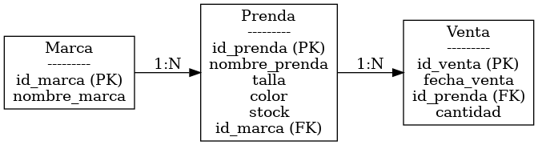

# 🛍️ Tienda de Ropa - Base de Datos

Bienvenido al repositorio del proyecto **Tienda de Ropa**, este contiene una base de datos relacional desarrollada en **MySQL**. Este sistema está diseñado para gestionar el inventario de una tienda de ropa, incluyendo información sobre las **marcas**, **prendas**, y **ventas**.

